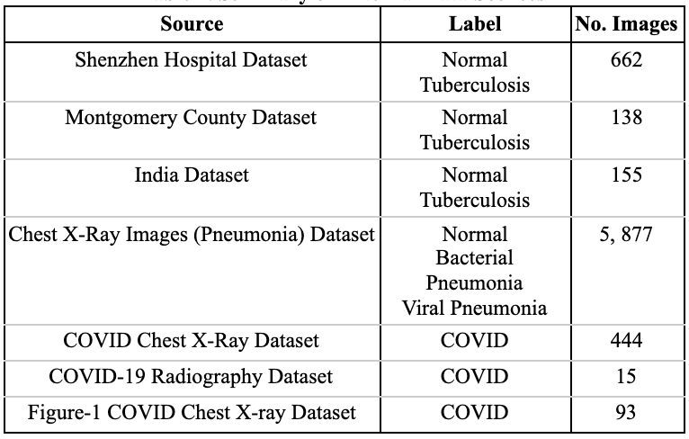

## COVI-CXR-AI
### This repository is organized as follows:
/dataset
- /bacterial
- /covid
- /normal
- /viral

/performance
- /png
- INSTRUCTIONS.ipynb
- TEST.ipynb
- /test_functions

### Dataset Sources:
* The images were aggregated from multiple sources shown in the table below
* Moreover, an additional of 1,171 CXR images from a total of 821 Filipino cohorts were included in the study. The additional images were obtained through the study - A Retrospective Study on the Accuracy of AI-Powered Reading of Chest X-Ray in the Diagnosis of COVID-19 Pneumonia in a Tertiary Hospital (CHERISH study)